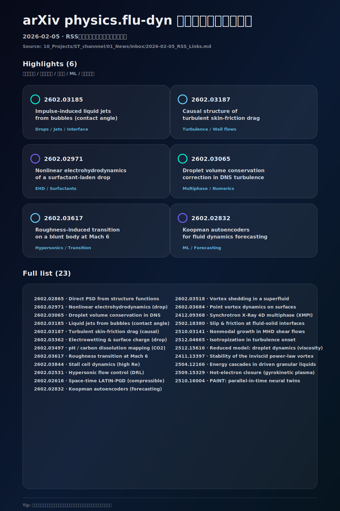

# 流体論文インフォグラフィック（arXiv physics.flu-dyn / 2026-02-05）

> [!info] ソース
> - `10_Projects/ST_channnel/01_News/Inbox/2026-02-05_RSS_Links.md` の `physics.flu-dyn updates on arXiv.org`

## 論文リンク（23本）
- [Direct power spectral density estimation from structure functions without Fourier transforms](https://arxiv.org/abs/2602.02865)
- [Nonlinear electrohydrodynamics of a surfactant-laden leaky dielectric drop](https://arxiv.org/abs/2602.02971)
- [An effective correction method for droplet volume conservation in direct numerical simulation of droplet-laden turbulence](https://arxiv.org/abs/2602.03065)
- [Impulse-induced liquid jets from bubbles with arbitrary contact angles](https://arxiv.org/abs/2602.03185)
- [Causal structures of turbulent skin-friction drag in wall-bounded turbulent flows](https://arxiv.org/abs/2602.03187)
- [How Spontaneous Electrowetting and Surface Charge affect Drop Motion](https://arxiv.org/abs/2602.03362)
- [A comparison of different image analysis techniques for mapping spatiotemporal pH and carbon dissolution in density-driven convection of CO2 in water](https://arxiv.org/abs/2602.03497)
- [Distributed Roughness-Induced Transition on a Blunt Body at Mach 6: a Numerical Investigation](https://arxiv.org/abs/2602.03617)
- [Tracking stall cell dynamics at high Reynolds numbers](https://arxiv.org/abs/2602.03844)
- [Hypersonic Flow Control: Generalized Deep Reinforcement Learning for Hypersonic Intake Unstart Control under Uncertainty](https://arxiv.org/abs/2602.02531)
- [A space-time LATIN-PGD strategy for solving Newtonian compressible flows](https://arxiv.org/abs/2602.02616)
- [Koopman Autoencoders with Continuous-Time Latent Dynamics for Fluid Dynamics Forecasting](https://arxiv.org/abs/2602.02832)
- [Dynamic similarity of vortex shedding in a superfluid flowing past a penetrable obstacle](https://arxiv.org/abs/2602.03518)
- [Point Vortex Dynamics on Closed Surfaces](https://arxiv.org/abs/2602.03684)
- [Synchrotron X-Ray Multi-Projection Imaging (XMPI) for High-Resolution 4D Characterization of Multiphase Flows](https://arxiv.org/abs/2412.09368)
- [Slip and friction at fluid-solid interfaces: Concept of adsorption layer](https://arxiv.org/abs/2502.18380)
- [Nonmodal growth and optimal perturbations in magnetohydrodynamic shear flows](https://arxiv.org/abs/2510.03141)
- [Drift towards isotropization during the 3D hydrodynamic turbulence onset](https://arxiv.org/abs/2512.04665)
- [A reduced model for droplet dynamics with interfacial viscosity](https://arxiv.org/abs/2512.15616)
- [Stability of the Inviscid Power-Law Vortex](https://arxiv.org/abs/2411.13397)
- [Energy Cascades in Driven Granular Liquids : A new Universality Class? I : Model and Symmetries](https://arxiv.org/abs/2504.12166)
- [The hot-electron closure of the moment-based gyrokinetic plasma model](https://arxiv.org/abs/2509.15329)
- [PAINT: Parallel-in-time Neural Twins for Dynamical System Reconstruction](https://arxiv.org/abs/2510.16004)

