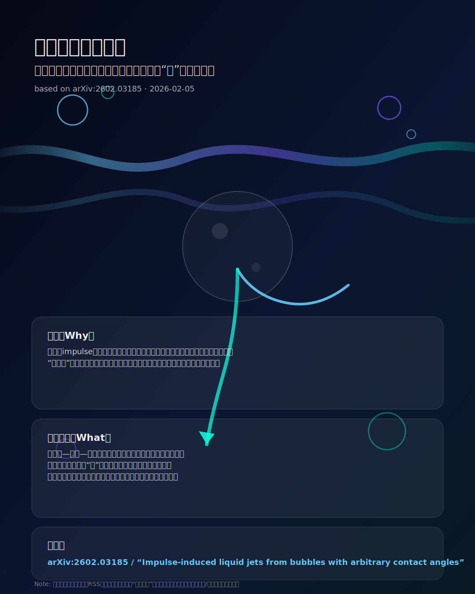

# 流体論文ポスター：泡からの液体ジェット（接触角が“形”を決める）

> [!info] 引用元
> [Impulse-induced liquid jets from bubbles with arbitrary contact angles (arXiv:2602.03185)](https://arxiv.org/abs/2602.03185)

## 使い方（編集ポイント）
- ポスター内の「問い」「見どころ」は、論文の要旨に合わせて言い切りに直す
- “この研究で一番刺さる図”があるなら、中央モチーフを差し替える（SVG編集）

