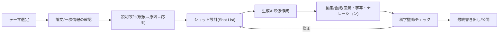

# YouTube科学技術コンテンツ 生成AI映像 設計書案

作成日: 2026-02-21  
対象: ST Channel（科学技術解説コンテンツ）

---

## 1. 目的とゴール

### 1.1 目的
- 生成AIで制作した高精度な映像により、科学技術の仕組みを「見た瞬間に理解できる」コンテンツを作る。
- テキスト説明に頼りすぎず、動き・因果・構造を映像として直感伝達する。

### 1.2 ゴール（初期）
- 6〜10分のYouTube動画を継続制作できる運用フローを確立する。
- 視聴者が「面白い」だけでなく「仕組みを説明できる」状態まで到達させる。

### 1.3 KPI（初期運用の評価指標）
- 平均視聴維持率: 45%以上
- 冒頭30秒の離脱率: 35%未満
- コメントでの理解指標: 「仕組みがわかった」系コメント比率を定点観測
- 制作指標: 1本あたり制作期間7日以内、リテイク回数3回以内

---

## 2. コンテンツ設計方針

### 2.1 編集方針
- 1テーマ1動画（論点を絞る）
- 1シーン1メッセージ（同時に複数概念を詰め込まない）
- 「現象 → 原因 → 応用」の順で構成する

### 2.2 映像方針
- フォトリアル映像 + 図解オーバーレイのハイブリッド
- カメラ移動は意味を持たせる（ズーム=スケール遷移、パン=因果追跡）
- 物理法則に反する動きは意図がない限り禁止

### 2.3 ナラティブ方針
- 「驚きの問い」から開始（例: なぜ触覚で時間感覚が変わるのか）
- 結論先出し + 理解の分解（視聴者が迷わない）
- 最後に「次の疑問」を残してシリーズ化可能にする

---

## 3. 想定ターゲット

- メイン: 18〜40歳、理工系に興味がある一般層
- サブ: エンジニア・学生・研究者見習い層
- ニーズ:
  - 数式だけでなく「動き」で理解したい
  - 最新トピックを短時間で把握したい
  - 難解な概念を人に説明できるレベルまで理解したい

---

## 4. 制作パイプライン設計

### 4.1 プリプロ（設計）
- 入力: テーマ、一次情報（論文・公式資料）
- 出力:
  - 3行要約（何が新しいか）
  - 誤解されやすい点リスト
  - Shot List（秒単位）

### 4.2 プロダクション（生成）
- Shot Listごとに映像を生成
- 同一シーンのバリエーションを最低3本出す
- 採用基準:
  - 動きの整合性
  - 被写体の形状安定性
  - 視覚ノイズの少なさ

### 4.3 ポスト（編集・検証）
- 図解レイヤー（矢印、ラベル、単位、凡例）を追加
- ナレーションと同期（0.2秒単位で調整）
- 科学的整合チェック後に公開版を確定

---

## 5. Shot List仕様（テンプレート）

| 項目 | 内容 |
|---|---|
| Shot ID | 例: S03 |
| 尺 | 例: 00:45–01:05 |
| 学習目標 | このシーンで理解させる概念 |
| 被写体 | 何を見せるか（対象、スケール） |
| 動き要件 | 速度、方向、周期、相互作用 |
| カメラ要件 | 固定/ドリー/俯瞰など |
| 可視化補助 | 矢印、色分け、注釈、グラフ |
| NG要件 | 禁止表現（誤解・破綻パターン） |
| 根拠リンク | 論文図表、教科書、公式資料 |

---

## 6. プロンプト設計ルール（映像精度向上）

### 6.1 基本構造
1. 被写体定義（何が、どの状態か）
2. 動作定義（どう動くか、速度、順序）
3. 物理制約（重力、衝突、流体、電磁など）
4. カメラ制約（視点、焦点距離、移動）
5. 品質制約（ブラー、破綻、ノイズの抑制）
6. 禁止事項（形状崩れ、不要な要素）

### 6.2 運用ルール
- 1プロンプト1現象（複合現象は分割）
- 「見た目」より「因果が読める動き」を優先
- 生成結果を次ショットに使う場合は連続性（光源・色・視点）を固定

---

## 7. 品質保証（QA）設計

### 7.1 科学的QA
- 主張と映像の対応関係を明記（どの根拠に基づくか）
- 断定表現は根拠レベルを明示（仮説/検証済み/合意形成済み）
- 誤解を招く比喩は注釈で補正

### 7.2 映像QA
- 連続フレームで形状が不自然に変化していないか
- 動きの方向・速度が説明内容と一致しているか
- 画面情報密度が高すぎないか（1秒で読み切れる量か）

### 7.3 視聴者理解QA（簡易ユーザーテスト）
- テスト質問:
  - 「この現象の原因を一言で説明できるか？」
  - 「何が入力で何が出力か説明できるか？」
- 3〜5名で確認し、誤答が多い箇所を再編集

---

## 8. 体制と役割（最小構成）

- 企画/監修: 1名（科学的正確性と構成）
- 生成オペレーター: 1名（プロンプト・生成管理）
- 編集: 1名（合成・テロップ・ナレーション）

※ 1人運用時は、工程ごとにチェックリストを分離し「制作モード」と「監修モード」を切り替える。

---

## 9. 初回PoC実行計画（1本目）

### 9.1 PoCテーマ例
- 候補A: 触覚と時間知覚
- 候補B: 量子Magicとワームホール
- 候補C: 恒星間天体の観測網

### 9.2 スケジュール（7日想定）
- Day 1: テーマ確定・一次情報整理
- Day 2: 台本初稿・Shot List作成
- Day 3-4: 映像生成（主要ショット）
- Day 5: 編集・図解合成
- Day 6: QA・修正
- Day 7: 書き出し・公開・指標計測開始

### 9.3 PoC完了条件
- 動きの破綻が主要ショットで許容範囲内
- 視聴者テストで要点理解率70%以上
- 次回制作へ再利用できるテンプレートを残す

---

## 10. リスクと対策

- リスク: 映像は綺麗だが科学的に誤解を生む  
  対策: 「根拠リンク」と「NG要件」をShotごとに必須化

- リスク: 生成の試行回数が増えて制作が遅延  
  対策: Shot優先度（Must/Should/Could）を事前定義

- リスク: 権利・出典表記の不備  
  対策: 参考文献、素材起源、生成AI使用方針を動画概要欄に明記

- リスク: 視聴維持率が伸びない  
  対策: 冒頭15秒の「問い」演出をA/Bテスト

---

## 11. 運用テンプレート（次アクション）

初回制作で、以下テンプレートを固定化する。
- テーマ選定シート（新規性・視覚化適性・誤解リスク）
- 台本テンプレート（Hook/現象/原因/応用/まとめ）
- Shot Listテンプレート（本設計書5章）
- QAチェックシート（本設計書7章）

これにより、企画ごとの差分は「科学内容」に集中させ、制作品質のばらつきを抑える。
